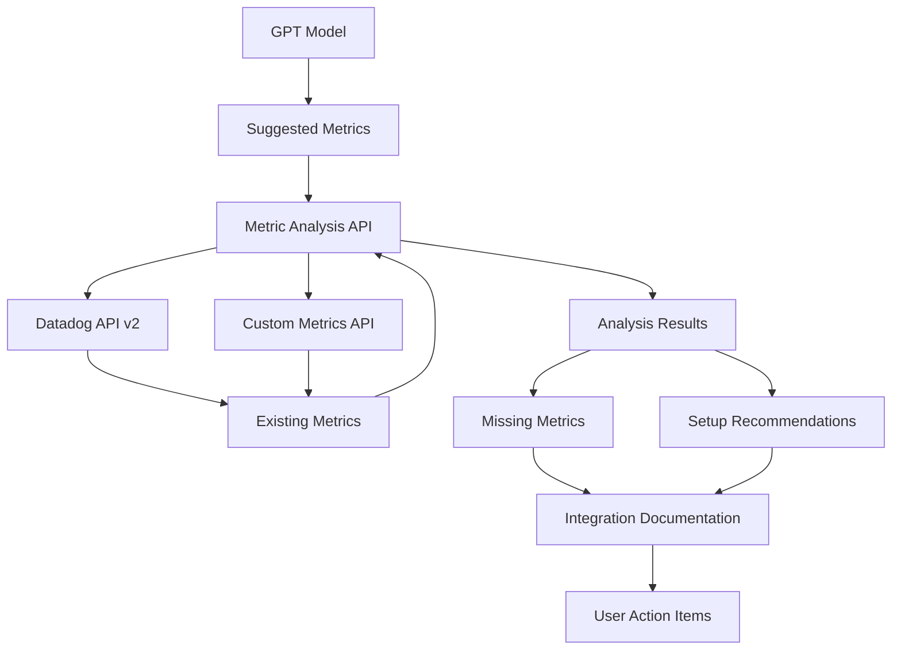

# Metric Analysis Feature Documentation

This feature enables you to analyze suggested metrics from your GPT model against customer's existing Datadog metrics, identify missing metrics, and provide setup documentation for implementing them.

## Overview

The Metric Analysis Service compares suggested metrics with customer's existing metrics and provides:
- **Coverage Analysis**: Shows what percentage of suggested metrics are already available
- **Missing Metrics**: Lists metrics that need to be set up
- **Setup Recommendations**: Prioritized list of integrations to configure
- **Documentation Links**: Direct links to Datadog integration setup guides

## API Endpoints

### 1. Analyze Metrics
```http
POST /metrics/analyze
```

**Request Body:**
```json
{
  "suggested_metrics": [
    {
      "metric_name": "aws.ec2.cpuutilization",
      "type": "gauge",
      "unit": "percent", 
      "description": "CPU utilization percentage for EC2 instances"
    }
  ],
  "customer_id": "customer123"
}
```

**Response:**
```json
{
  "success": true,
  "message": "Metric analysis completed successfully!",
  "coverage_percentage": 75.0,
  "existing_metrics": ["system.cpu.user", "system.mem.used"],
  "missing_metrics": [
    {
      "metric_name": "nginx.net.connections",
      "integration": "nginx",
      "description": "Active connections to Nginx server",
      "priority": "medium",
      "setup_url": "https://docs.datadoghq.com/integrations/nginx/",
      "setup_steps": ["Enable nginx status module", "..."]
    }
  ],
  "recommendations": [
    {
      "integration": "nginx",
      "missing_metrics_count": 3,
      "priority": "high",
      "setup_url": "https://docs.datadoghq.com/integrations/nginx/"
    }
  ]
}
```

### 2. Get Customer Metrics
```http
GET /metrics/customer/{customer_id}
```

**Response:**
```json
{
  "success": true,
  "customer_id": "customer123",
  "metrics": ["system.cpu.user", "system.mem.used", "..."],
  "count": 150
}
```

### 3. Get Integration Setup Guide
```http
GET /integration/{integration_name}/setup
```

**Response:**
```json
{
  "success": true,
  "setup_guide": {
    "integration": "nginx",
    "description": "Configure Nginx integration to monitor web server performance",
    "setup_url": "https://docs.datadoghq.com/integrations/nginx/",
    "estimated_setup_time": "5-10 minutes",
    "setup_steps": [
      "Enable nginx status module",
      "Configure nginx.conf with status endpoint",
      "Update nginx.yaml configuration file"
    ],
    "available_metrics": ["nginx.net.connections", "nginx.net.request_per_s"]
  }
}
```

### 4. Get Integration Metrics
```http
GET /integration/{integration_name}/metrics
```

**Response:**
```json
{
  "success": true,
  "integration": "aws",
  "metrics": ["aws.ec2.cpuutilization", "aws.rds.database_connections"],
  "documentation": {
    "setup_url": "https://docs.datadoghq.com/integrations/amazon_web_services/",
    "description": "Set up AWS integration to monitor EC2, RDS, ELB and other AWS services"
  },
  "count": 9
}
```

## Configuration

### Environment Variables

```bash
# Required: Datadog API credentials
export DATADOG_API_KEY="your_api_key"
export DATADOG_APP_KEY="your_app_key"
export DATADOG_BASE_URL="https://api.datadoghq.com"

# Optional: Custom metrics endpoint
export CUSTOMER_METRICS_ENDPOINT="https://your-api.com/metrics/{customer_id}"
```

### Custom Metrics Endpoint

If you have a custom API to retrieve customer metrics, set the `CUSTOMER_METRICS_ENDPOINT` environment variable. The system supports these response formats:

```json
// Simple array
["metric1", "metric2", "metric3"]

// Object with 'metrics' key
{"metrics": ["metric1", "metric2"]}

// Object with 'data' key  
{"data": ["metric1", "metric2"]}
```

## Integration Priority Levels

The system automatically assigns priority levels to missing metrics:

- **HIGH**: Performance and availability metrics (CPU, memory, errors, latency)
- **MEDIUM**: Throughput and capacity metrics (requests, connections, usage)
- **LOW**: Other metrics

## Supported Integrations

The system includes setup documentation for:

- **AWS** (EC2, RDS, ELB): 15-30 minutes setup
- **Nginx**: 5-10 minutes setup
- **MySQL**: 10-15 minutes setup
- **PostgreSQL**: 10-15 minutes setup
- **Redis**: 5-10 minutes setup
- **Docker**: 10-20 minutes setup
- **Kubernetes**: 20-45 minutes setup
- **Custom**: Variable setup time

## Usage Examples

### Basic Analysis
```python
import requests

response = requests.post("http://localhost:8000/metrics/analyze", json={
    "suggested_metrics": [
        {
            "metric_name": "nginx.net.connections",
            "type": "gauge",
            "description": "Nginx connections"
        }
    ],
    "customer_id": "customer123"
})

result = response.json()
print(f"Coverage: {result['coverage_percentage']:.1f}%")
```

### Get Setup Instructions
```python
response = requests.get("http://localhost:8000/integration/nginx/setup")
setup_guide = response.json()['setup_guide']

print(f"Setup time: {setup_guide['estimated_setup_time']}")
for step in setup_guide['setup_steps']:
    print(f"- {step}")
```

## Workflow Integration

1. **Generate Metrics**: Your GPT model suggests metrics based on user requirements
2. **Analyze Coverage**: Send suggested metrics to `/metrics/analyze`
3. **Identify Gaps**: Review missing metrics and their priority levels
4. **Get Setup Guides**: Fetch detailed setup instructions for missing integrations
5. **Present to User**: Show coverage analysis and actionable setup recommendations

## Error Handling

The API returns standard HTTP status codes:

- **200**: Success
- **400**: Bad request (invalid input)
- **500**: Server error (missing configuration, API failures)

All error responses include descriptive messages:

```json
{
  "detail": "Metric analysis service not initialized - Datadog credentials missing"
}
```

## Testing

Run the test suite to verify functionality:

```bash
# Mock test (no API calls)
python test_metric_analysis.py

# Example usage (requires running server) 
python example_metric_analysis_usage.py
```

## Data Flow



## Next Steps

1. Configure your Datadog API credentials
2. Set up the optional custom metrics endpoint
3. Integrate with your GPT model's output format
4. Test with real customer data
5. Present results in your UI with actionable recommendations 